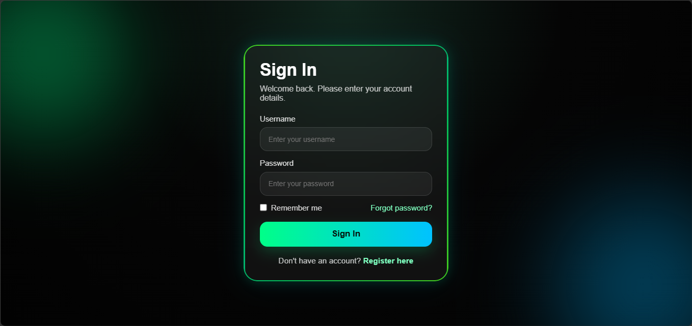

# ⚡ Neon Glassmorphism Login Page

A modern Neon Glassmorphism login page built with pure HTML and CSS. This design combines a dark futuristic background, glowing neon borders, soft blur effects, and smooth hover interactions to create a premium glass-like UI.

## 📸 Preview



## ✨ Features

* Neon glow interface
* Futuristic dark theme
* Animated glowing background
* Glassmorphism login card
* Smooth input focus effect
* Stylish gradient button
* Responsive layout
* Pure HTML & CSS

## 🛠️ Built With

* HTML5
* CSS3

## 📂 Project Structure

```text
Neon-Glassmorphism-Login-Page/
│
├── index.html
├── preview.png
└── README.md
```

## 🚀 Getting Started

### Clone the Repository

```bash
git clone https://github.com/Jeremykoresh/Neon-Glassmorphism-Login-Page.git
```

### Open the Project

Simply open the `index.html` file in your preferred web browser.

No installation or external dependencies are required.

## 🎨 Customization

You can easily customize:

* Neon color schemes
* Background gradient
* Glow intensity
* Glassmorphism blur level
* Button animation
* Border effects
* Typography
* Form labels and placeholder text
* Layout spacing

## 💡 Learning Objectives

This project is suitable for developers who want to learn:

* HTML structure
* CSS layout
* Neon UI effects
* Glassmorphism design
* Responsive web design
* Hover and focus interactions
* Simple modern frontend styling

## 📱 Responsive Design

The interface is designed to work across desktop, tablet, and mobile devices.

## ⭐ Support

If you found this project helpful, consider giving it a star on GitHub.

## 👨‍💻 Author

Jeremy Koresh

GitHub: [https://github.com/Jeremykoresh](https://github.com/Jeremykoresh)

## 📄 License

This project is available for educational and personal learning purposes.

## 📌 Notes

This project is best described as a Neon Glassmorphism Login Page rather than a full Cyberpunk UI, because its main visual style focuses on glow, blur, and glass-like panels.
